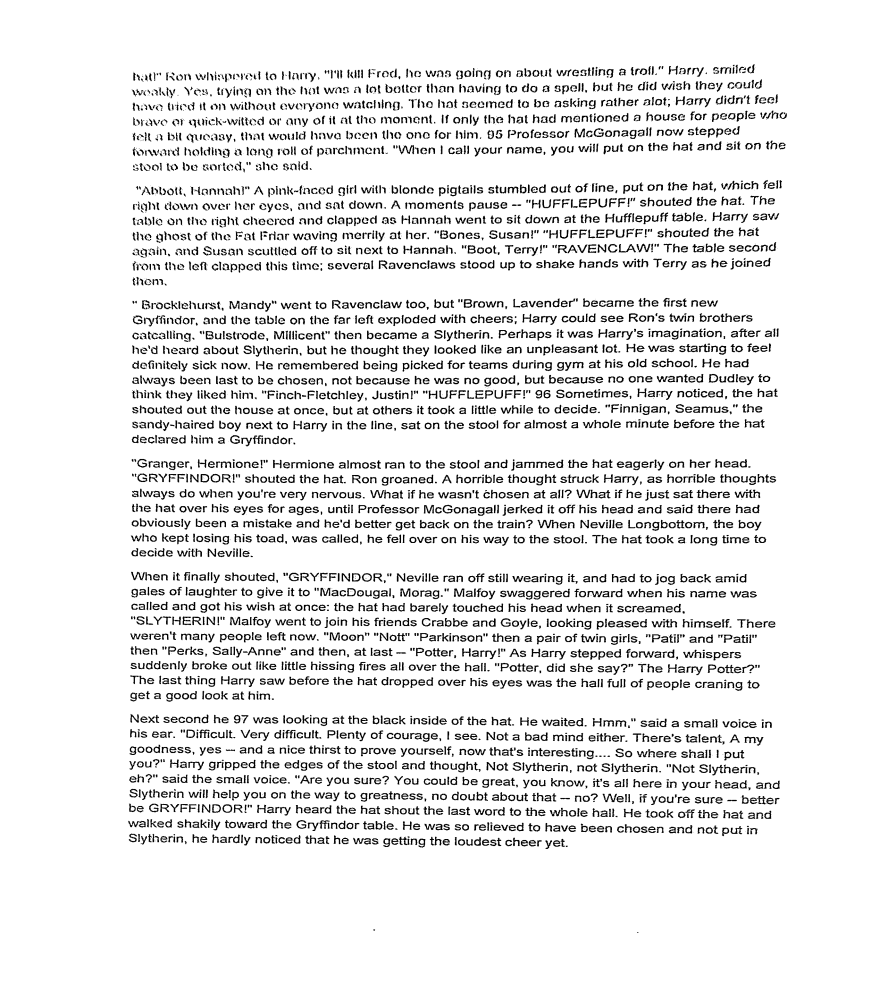

# ScamCanner
## How to Run?
To run the ScamCanner make a local directory called "Image Data" and add the images whose documented version you would like to see. If it is unsucessful for a particular image then it will print no document found in the console.

## How it Works?

ScamCanner is an Adobe Scan/Cam Scanner like software which is used to produce scanned documents from camera images, i.e., given an image of a document, in varied orientations and lighting, it identifies the region of interest of the document in terms of edges and corners and correctly orients and displays the image as a scanned copy of the document. It was a project that meant to study different feature detectors and use logistic regression to create a trained model that helps in converting images of documents into a proper scanned document. For this, we use SURF to detect features and apply a Hough Transformation based implementation to obtain a bounding box. This is followed by homography and thresholding to make the image clearer and give it the scanned document feel.

For a more detailed understanding, please check out [the document](./ScamCanner.pdf) above.

Following are some images illustrating some the processes taking place.

---> Applying various filters to remove text from an image.


---> Classifying Feature Points obtained from SURF as edge using a pre-trained classification model.


---> Fitting lines through feature points classified as edges to get the bounding box


----> Final output after performing homography and thresholding.



## Made by

Agni Purani, Neha Dalmia, Rishab Agarwal, Rohit Raj, Rohit Sutradhar, Satwik Chappidi

Helped by: Archit Rungta, Balaji Udayagiri, Debjoy Saha, Raja Raghav, Yash Soni

## Modules

```
astroid==2.3.3 cycler==0.10.0 decorator==4.4.2 imageio==2.8.0 imbalanced-learn==0.6.2 imblearn==0.0 imutils==0.5.3 isort==4.3.21 joblib==0.14.1 kiwisolver==1.2.0 lazy-object-proxy==1.4.3 matplotlib==3.2.1 mccabe==0.6.1 networkx==2.4 numpy==1.18.2 pandas==1.0.3 Pillow==7.1.1 pylint==2.4.4 pyparsing==2.4.7 python-dateutil==2.8.1 pytz==2019.3 PyWavelets==1.1.1 scikit-image==0.16.2 scikit-learn==0.22.2.post1 scipy==1.4.1 seaborn==0.10.0 six==1.14.0 typed-ast==1.4.1 wrapt==1.11.2
```

To use OpenCV, you will need to install it from the source. Please follow the this tutorial - [Installing OpenCV 4 on Ubuntu](https://www.pyimagesearch.com/2018/08/15/how-to-install-opencv-4-on-ubuntu/) . Please don't forgot to set the Non-Free tag to ON. 


